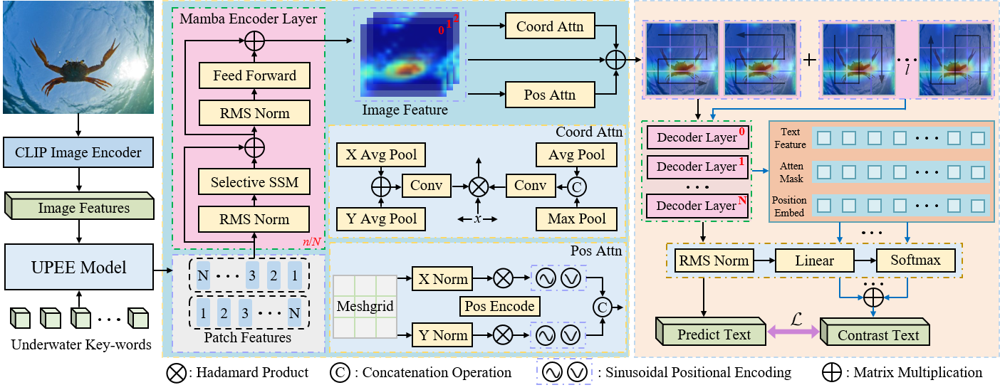
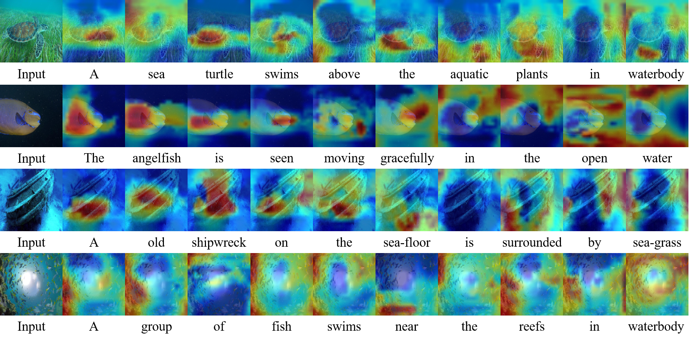
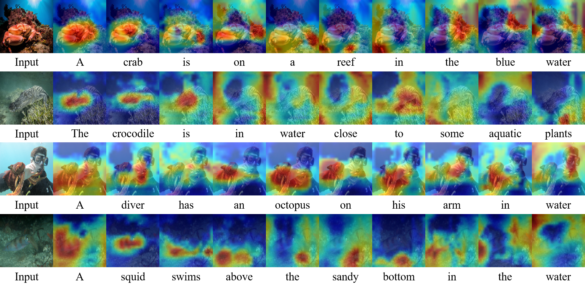

  <h1 align="center">P^2UIC: Plug-and-Play Physics-Aware Contrastive Mamba Framework for Underwater Image Captioning</h1>
  

 
    <strong>Chunlei Wang</strong></a>
    ·
    <strong>Wenquan Feng</strong></a>
    ·
    <strong>Binghao Liu</strong></a>
    ·
    <strong>Xianyu Zhao</strong></a>    
    ·
    <strong>Kejun Zhao</strong></a>
    ·
    <strong>Qi Zhao</strong></a>
     
 

  

## Highlight!!!!
P^2UIC: Plug-and-Play Physics-Aware Contrastive Mamba Framework for Underwater Image Captioning

## Abstract
Underwater Image Captioning (UIC) aims to automatically generate accurate descriptive textual for input underwater images, which faces unique challenges due to environmental distortions such as degraded image quality, ambiguous object categorization, and computational resource limitations. Existing Image Captioning (IC) models, primarily designed for natural scenes, often underperform in underwater environments because they fail to address these domain-specific issues. Recently, the Mamba framework with its linear reasoning capabilities and efficient performance has emerged as a popular alternative to Transformer framework. In this paper, we propose P^2UIC, a plug-and-play physics-aware contrastive Mamba framework for underwater image captioning consisting of Underwater Physics Environment-aware Enhancement (UPEE) and Contrastive Multi-sequence Mamba Decoder (CMMD). UPEE enables plug-and-play underwater perception enhancement for any IC model by inferring physical parameters and incorporating environment-specific keywords. Meanwhile, CMMD leverages semantic information from multi-sequence visual features to improve text generation via contrastive learning across multiple text embedding layers. To address the scarcity of evaluation benchmarks, we release two UIC benchmarks by extending existing underwater segmentation datasets and provide expert-annotated descriptions. Our P$^2$UIC effectively handles UIC tasks and achieves state-of-the-art (SOTA) results. Ablation studies and visualization experiments demonstrate the effectiveness of the proposed components.

## TODO
- [x] Release two benchmark datasets:UWS-IC and SUIM-IC
- [ ] Release checkpoints and inference codes
- [ ] Release training codes

## Datasets
* `UWS-IC`:  | [Baidu Drive(pw: PUIC)](https://pan.baidu.com/s/14XYP0TiIefezCfn6XXZdyQ).
* `SUIM-IC`:  | [Baidu Drive(pw: PUIC)](https://pan.baidu.com/s/1VOlKi8WOYNet7gdCmat6_w).

  

  

  

## Citation
If you have any question, please discuss with me by sending email to wcl_buaa@buaa.edu.cn.
